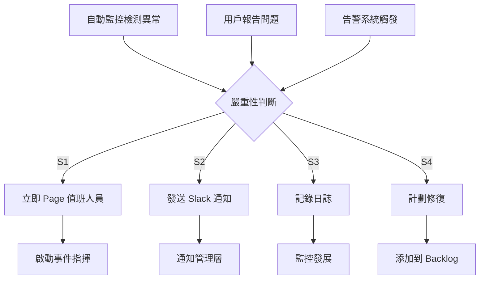

# FamMap 事件應急響應指南

## 概述

本文檔定義了 FamMap 在生產環境中發生事件時的應急響應流程和最佳實踐。

## 事件分類

### Severity 1 (Critical) - 紅色警報
- **定義**: 服務完全不可用，對用戶無法提供任何功能
- **影響**: 所有用戶無法訪問
- **RTO**: < 15 分鐘
- **響應**: 立即全隊動員，停止其他工作

### Severity 2 (High) - 橙色警報
- **定義**: 主要功能受損，但部分功能可用
- **影響**: 部分用戶無法使用核心功能
- **RTO**: < 1 小時
- **響應**: 立即通知值班人員

### Severity 3 (Medium) - 黃色警報
- **定義**: 非核心功能受損或性能降級
- **影響**: 用戶體驗下降但仍可用
- **RTO**: < 4 小時
- **響應**: 在工作時間內處理

### Severity 4 (Low) - 藍色信息
- **定義**: 輕微問題或性能輕微下降
- **影響**: 最小化
- **RTO**: 計劃維護窗口
- **響應**: 記錄並計劃修復

## 應急響應流程

### 檢測和報警 (0-5 分鐘)



### 初始響應 (5-15 分鐘)

#### 第一步: 啟動事件指揮體系 (ICS)
1. **事件指揮官** (Incident Commander)
   - 領導應急響應
   - 決定升級和回滾
   - 與管理層溝通

2. **技術負責人** (Technical Lead)
   - 領導根本原因分析
   - 指導修復工作
   - 驗證解決方案

3. **溝通官** (Communications Lead)
   - 更新狀態頁面
   - 與用戶溝通
   - 記錄所有更新

#### 第二步: 初始診斷
```bash
# 1. 檢查服務狀態
curl http://localhost:3001/health
curl http://localhost:3001/health/ready

# 2. 檢查系統資源
ps aux | grep python3 | grep start_server
top -p $(cat backend.pid)

# 3. 檢查日誌
tail -100 logs/backend.log | grep -i error
tail -100 logs/frontend.log | grep -i error

# 4. 檢查依賴項
curl -s http://localhost:3001/health/live
```

#### 第三步: 立即緩解措施
- 如果服務不響應: 執行服務重啟
- 如果資源耗盡: 清理日誌和緩存
- 如果依賴項失敗: 隔離並切換備用
- 如果無法修復: 啟動故障轉移

### 深化響應 (15-60 分鐘)

#### 根本原因分析
```
1. 時間線: 事件發生的確切時間和序列
2. 影響: 受影響的用戶、功能和數據
3. 根本原因: 事件的直接和根本原因
4. 觸發因素: 導致此事件發生的條件
5. 預防: 防止未來發生的措施
```

#### 詳細日誌分析
```bash
# 查看特定時間的日誌
journalctl --since "2026-03-26 12:00:00" --until "2026-03-26 13:00:00"

# 查找錯誤日誌
grep -i "error\|exception\|fatal" logs/*.log | sort

# 查看 API 性能
grep "request_duration_ms" logs/backend.log | awk '{sum+=$NF; count++} END {print "Average:", sum/count}'

# 追蹤特定請求
grep "request_id=abc123" logs/*.log
```

### 恢復和驗證 (60-120 分鐘)

#### 執行修復
```bash
# 應用修復後重新構建
npm run build  # 前端
pip install -r server/requirements.txt  # 後端

# 重新部署
./deploy-robust.sh

# 驗證部署
./health-check.sh
```

#### 驗證檢查清單
- [ ] 所有健康檢查端點返回 200
- [ ] API 的核心端點正常工作
- [ ] 前端加載無錯誤
- [ ] 數據庫連接正常
- [ ] 外部 API 依賴項正常
- [ ] 系統資源健康
- [ ] 用戶報告的功能已修復
- [ ] 性能指標恢復正常

### 事件結束和回顧 (事件後)

#### 結束標準
- [ ] 所有用戶都能訪問核心功能
- [ ] 系統指標已恢復正常
- [ ] 沒有已知的後遺效應
- [ ] 根本原因已確定
- [ ] 短期緩解措施已部署

#### 事後分析會 (Post-Incident Review)
進行於事件解決後 24-48 小時：

1. **事件概述**
   - 時間線和持續時間
   - 受影響的系統和用戶
   - 解決方案

2. **根本原因總結**
   - 始發事件
   - 貢獻因素
   - 失敗點

3. **行動項目**
   - 立即行動 (< 1 週)
   - 短期行動 (< 1 月)
   - 長期行動 (> 1 月)

4. **改進點**
   - 檢測可以改進
   - 響應可以改進
   - 防止措施

## 常見事件場景和響應

### 場景 1: Backend API 無響應

**症狀**:
- `/health` 端點超時
- 前端無法連接到 API
- 用戶看到連接錯誤

**診斷**:
```bash
# 檢查進程
ps aux | grep "python3 start_server"

# 檢查端口
lsof -i :3001

# 檢查日誌
tail -50 logs/backend.log
```

**立即行動**:
```bash
# 1. 嘗試服務重啟
kill $(cat backend.pid)
sleep 2
python3 start_server.py

# 2. 如果失敗，檢查端口衝突
lsof -i :3001 | awk 'NR!=1 {print $2}' | xargs kill -9

# 3. 清理並重啟
rm backend.pid
./deploy-robust.sh
```

**驗證**:
```bash
curl http://localhost:3001/health
curl http://localhost:3001/health/ready
```

### 場景 2: 高錯誤率

**症狀**:
- 5xx 錯誤率 > 10%
- 告警觸發
- 用戶報告間歇性故障

**診斷**:
```bash
# 查看錯誤模式
grep "status.*5[0-9][0-9]" logs/backend.log | head -20

# 查看最近的異常
tail -100 logs/backend.log | grep -i "error\|exception"

# 檢查資源
free -h
df -h

# 查看活動連接
lsof -p $(cat backend.pid) | wc -l
```

**立即行動**:
1. 識別錯誤的共同模式
2. 檢查最近的部署或更改
3. 隔離問題到特定端點或功能
4. 考慮部分降級 (禁用非核心功能)
5. 如果無法快速修復，回滾到最後已知的良好版本

### 場景 3: 高延遲

**症狀**:
- API 響應時間 > 5 秒
- 用戶報告應用程序反應遲鈍
- 性能指標告警

**診斷**:
```bash
# 查看查詢時間
grep "request_duration_ms" logs/backend.log | awk '{print $NF}' | sort -n | tail -10

# 查看慢查詢
grep "duration_ms.*[0-9][0-9][0-9][0-9]" logs/backend.log

# 檢查数据库连接
lsof -p $(cat backend.pid) | grep -i socket | wc -l
```

**立即行動**:
1. 檢查數據庫連接池是否耗盡
2. 查看是否有長時間運行的查詢
3. 檢查系統資源可用性
4. 考慮啟用查詢緩存
5. 檢查是否有新的耗時操作

### 場景 4: 磁盤空間不足

**症狀**:
- 磁盤使用率 > 95%
- 應用程序無法寫入日誌
- 文件上傳失敗

**診斷**:
```bash
# 檢查磁盤使用
df -h

# 查找大文件
find logs -name "*.log" -size +100M

# 查看日誌大小
du -sh logs/
```

**立即行動**:
```bash
# 1. 清理舊日誌
find logs -name "*.log" -mtime +7 -delete

# 2. 壓縮舊日誌
gzip logs/*.log.1

# 3. 監控磁盤空間
watch -n 60 'df -h'
```

## 通信模板

### 事件開始通知
```
🚨 INCIDENT: FamMap API Unavailable

Severity: S1 (Critical)
Start Time: 2026-03-26 12:30 UTC
Status: Investigating
Impact: All users unable to access API

We are actively investigating the issue and will provide updates every 15 minutes.
```

### 進度更新
```
📊 INCIDENT UPDATE: FamMap API Unavailable

Time: 2026-03-26 12:45 UTC
Elapsed: 15 minutes
Status: Root cause identified - database connection pool exhaustion

Action: Restarting database connection manager and monitoring for recurrence
ETA: Resolution in 10 minutes
```

### 事件解決通知
```
✅ INCIDENT RESOLVED: FamMap API Unavailable

Resolution Time: 2026-03-26 12:55 UTC
Duration: 25 minutes
Root Cause: Database connection pool misconfiguration

We have applied a fix and implemented monitoring to prevent recurrence.
```

## 參考資源

- [Monitoring and Alerting](./MONITORING_AND_ALERTING.md)
- [Operators Manual](./OPERATORS_MANUAL.md)
- [Deployment Guide](./DEPLOYMENT.md)

---

**文檔版本**: 1.0
**最後更新**: 2026-03-26
**維護者**: FamMap Operations Team
