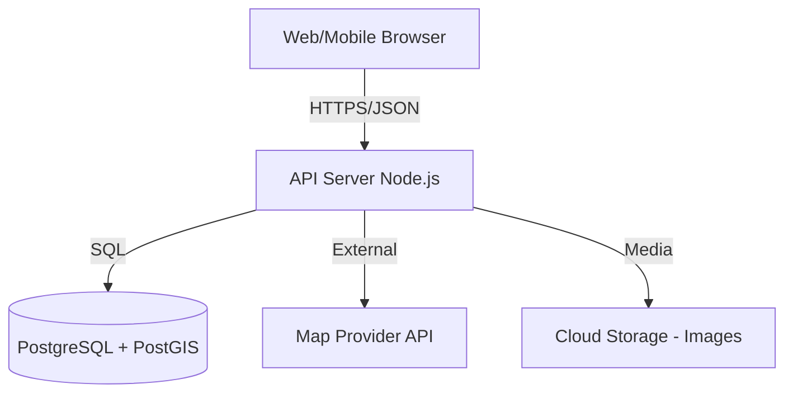

# FamMap (親子地圖) - System Architecture (SA)

## 1. System Architecture Overview
FamMap follows a modern Client-Server architecture, utilizing a Single Page Application (SPA) for the frontend and a RESTful API for the backend.

## 2. Component Responsibilities

### 2.1 Frontend (React + TypeScript)
- **Map Module:** Render map, handle zooming/panning, show markers, handle "find me".
- **Search Module:** Handle user queries, filter locations based on user preferences.
- **Location Module:** Show details of a specific location, display photos and reviews.
- **User Module:** Handle profile, favorites, and submissions (add/edit).
- **Localization Module:** Manage i18n for Traditional Chinese and English.

### 2.2 Backend (Node.js + Express)
- **API Router:** Route requests to appropriate controllers.
- **Location Controller:** Handle spatial queries (nearest locations), search, and CRUD for locations.
- **Review Controller:** Manage user ratings and comments.
- **Auth Controller:** (Future) Handle user sessions and permissions.
- **Spatial Service:** Interface with PostGIS for radius-based queries.

### 2.3 Database (PostgreSQL + PostGIS)
- Store location data with GEOMETRY/GEOGRAPHY types for spatial indexing.
- Store user, review, and facility metadata.

## 3. Data Flow
1. User opens app -> Frontend fetches user location -> Request `GET /api/locations?lat=X&lng=Y&radius=Z`.
2. Backend receives request -> Queries PostgreSQL using PostGIS `ST_DWithin`.
3. Database returns locations -> Backend transforms data to JSON.
4. Frontend receives JSON -> Renders markers on map.

## 4. Deployment Architecture
- **Frontend Hosting:** Vercel (Auto-deploy from main branch).
- **Backend Hosting:** Railway/Render (Managed container hosting).
- **Database:** Supabase or Managed PostgreSQL (with PostGIS extension).
- **CDN:** For static assets and map tiles (OpenStreetMap).

## 5. Third-party Dependencies
- **Maps:** Leaflet.js (Map rendering), OpenStreetMap (Tile provider).
- **Styling:** CSS Modules or Vanilla CSS.
- **Icons:** Lucide-react (General UI icons).
- **State Management:** React Context or Zustand.
- **Backend Libraries:** Express, Prisma or Kysely (ORM/Query Builder), Zod (Validation).
