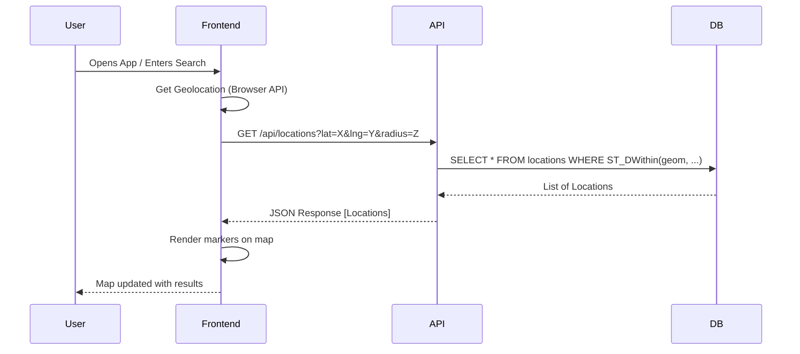

# FamMap (親子地圖) - System Design (SD)

## 1. API Definitions (RESTful)

### 1.1 Locations API
- `GET /api/locations?lat=X&lng=Y&radius=Z&category=...`
  - Fetch locations within a radius.
  - Returns: `Array<Location>`
- `GET /api/locations/:id`
  - Get details for a specific location.
  - Returns: `LocationDetail`
- `POST /api/locations` (Authenticated)
  - Suggest a new location.
  - Body: `LocationCreateDTO`
- `PATCH /api/locations/:id` (Authenticated)
  - Edit location details.
  - Body: `LocationUpdateDTO`

### 1.2 Reviews API
- `GET /api/locations/:id/reviews`
  - Get reviews for a location.
- `POST /api/locations/:id/reviews` (Authenticated)
  - Post a review.
  - Body: `{ rating, comment, photos[] }`

### 1.2.5 Events API (P2 Feature)
- `GET /api/locations/:id/events`
  - Get upcoming events for a location.
  - Returns: `Array<Event>`
- `POST /api/locations/:id/events` (Authenticated)
  - Create a new event for a location.
  - Body: `EventCreateDTO`

### 1.3 Favorites API (Authenticated)
- `GET /api/favorites`
  - List user's favorite locations.
- `POST /api/favorites`
  - Add a location to favorites.
  - Body: `{ location_id: UUID }`
- `DELETE /api/favorites/:location_id`
  - Remove a location from favorites.

### 1.4 Auth API
- `POST /api/auth/register`
  - Register a new user.
- `POST /api/auth/login`
  - Login and receive a token.
- `GET /api/auth/me` (Authenticated)
  - Get current user profile.

### 1.5 Static Data (i18n)
- `GET /api/i18n?lang=...`
  - Fetch translation keys.

## 2. Database Schema (PostgreSQL + PostGIS)

### 2.1 Table: `locations`
| Column | Type | Description |
|---|---|---|
| `id` | UUID (PK) | Unique identifier |
| `name_zh` | TEXT | Name in Traditional Chinese |
| `name_en` | TEXT | Name in English |
| `description_zh` | TEXT | Description in Traditional Chinese |
| `description_en` | TEXT | Description in English |
| `category` | VARCHAR(50) | e.g., 'park', 'nursing_room', 'restaurant' |
| `geom` | GEOMETRY(Point, 4326) | PostGIS spatial point (lng, lat) |
| `address_zh` | TEXT | Address in Traditional Chinese |
| `address_en` | TEXT | Address in English |
| `created_at` | TIMESTAMP | Creation time |
| `updated_at` | TIMESTAMP | Last update time |

### 2.2 Table: `facilities`
| Column | Type | Description |
|---|---|---|
| `id` | UUID (PK) | Unique identifier |
| `location_id` | UUID (FK) | Reference to `locations` |
| `type` | VARCHAR(50) | e.g., 'changing_table', 'high_chair', 'stroller_accessible' |
| `count` | INT | Number of units (if applicable) |

### 2.3 Table: `users`
| Column | Type | Description |
|---|---|---|
| `id` | UUID (PK) | Unique identifier |
| `email` | VARCHAR(255) | User email (unique) |
| `password_hash` | TEXT | Hashed password |
| `display_name` | TEXT | User display name |
| `created_at` | TIMESTAMP | |

### 2.4 Table: `favorites`
| Column | Type | Description |
|---|---|---|
| `id` | UUID (PK) | Unique identifier |
| `user_id` | UUID (FK) | Reference to `users` |
| `location_id` | UUID (FK) | Reference to `locations` |
| `created_at` | TIMESTAMP | |

### 2.5 Table: `reviews`
| Column | Type | Description |
|---|---|---|
| `id` | UUID (PK) | Unique identifier |
| `location_id` | UUID (FK) | Reference to `locations` |
| `user_id` | UUID (FK) | Reference to `users` |
| `rating` | INT (1-5) | User rating |
| `comment` | TEXT | User comment |
| `photos` | TEXT[] | Array of photo URLs |
| `created_at` | TIMESTAMP | |

### 2.6 Table: `events` (P2 Feature)
| Column | Type | Description |
|---|---|---|
| `id` | UUID (PK) | Unique identifier |
| `location_id` | UUID (FK) | Reference to `locations` |
| `title_zh` | TEXT | Event title in Traditional Chinese |
| `title_en` | TEXT | Event title in English |
| `description_zh` | TEXT | Event description in Traditional Chinese |
| `description_en` | TEXT | Event description in English |
| `event_type` | VARCHAR(50) | e.g., 'birthday_party', 'class', 'workshop', 'performance', 'activity' |
| `start_date` | TIMESTAMP | Event start time |
| `end_date` | TIMESTAMP | Event end time |
| `ageRange_min` | INT | Minimum recommended age |
| `ageRange_max` | INT | Maximum recommended age |
| `capacity` | INT | Maximum number of participants |
| `price` | FLOAT | Event price |
| `created_at` | TIMESTAMP | Creation time |
| `updated_at` | TIMESTAMP | Last update time |

## 3. Error Handling Strategy
- **Client Errors (4xx):**
  - `400 Bad Request`: Validation failure (Pydantic error details returned).
  - `401 Unauthorized`: Not logged in.
  - `404 Not Found`: Resource doesn't exist.
- **Server Errors (5xx):**
  - `500 Internal Server Error`: Generic error message for client, detailed log for server.
- **I18n for Errors:** Error messages should be translatable or returned as codes (e.g., `ERR_LOCATION_NOT_FOUND`).

## 4. Sequence Diagram: Fetching Nearby Locations



## 5. Module Interface Definition (TypeScript)

### 5.1 Location Interface
```typescript
interface Location {
  id: string;
  name: {
    zh: string;
    en: string;
  };
  category: 'park' | 'nursing_room' | 'restaurant' | 'medical';
  coordinates: {
    lat: number;
    lng: number;
  };
  facilities: string[]; // e.g., ['changing_table', 'stroller_accessible']
  averageRating: number;
}
```

### 5.2 I18n Interface
```typescript
interface TranslationKeys {
  common: {
    searchPlaceholder: string;
    findMe: string;
    loading: string;
  };
  categories: {
    park: string;
    nursing_room: string;
    restaurant: string;
  };
  facilities: {
    changing_table: string;
    high_chair: string;
  };
}
```
